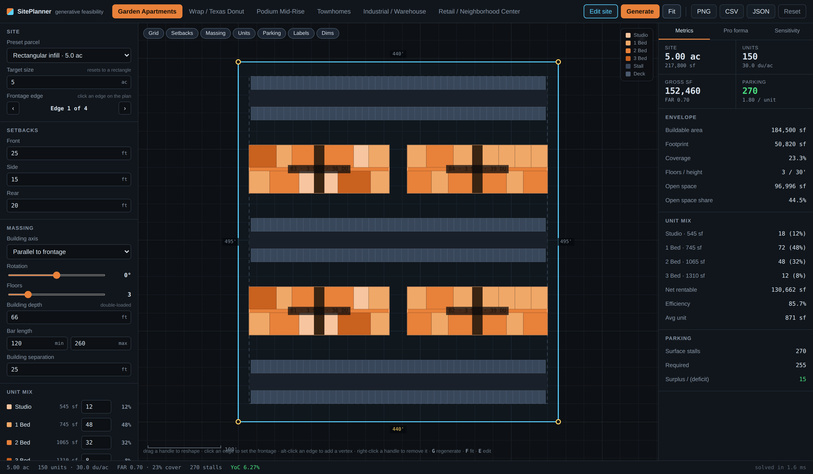
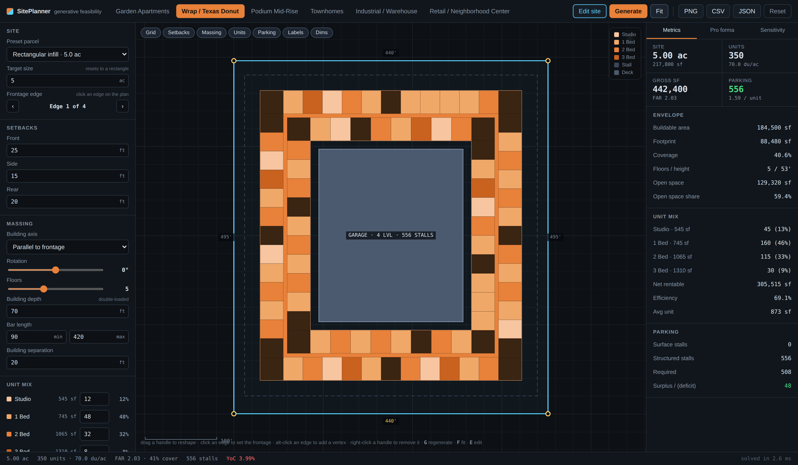
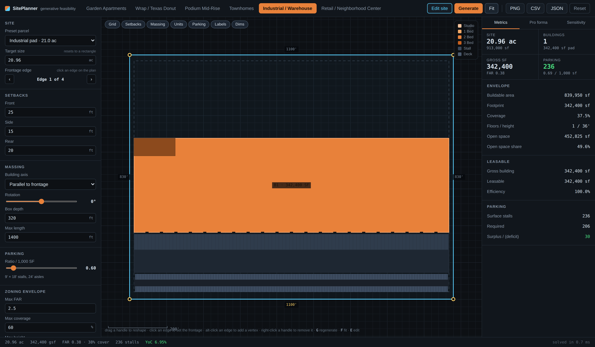

# SitePlanner

A generative real-estate feasibility tool in the spirit of [TestFit](https://testfit.io):
draw a parcel, pick a building type, and get a massed site plan with unit layouts,
parking and a pro forma — recomputed on every keystroke.

Everything runs in the browser. No build step, no dependencies, no server-side
anything: plain ES modules, one `<canvas>`, and about 2,800 lines of JavaScript.



<p align="center">
  
  
</p>

## Run it

```bash
./run.sh              # serves on http://localhost:8080
```

Or point any static file server at the repository root. (ES modules need HTTP —
opening `index.html` straight off the filesystem will not work.)

## What it does

**Draw the site.** Start from a preset parcel or type a target acreage, then drag
the vertex handles to reshape it. Click an edge to make it the street frontage,
alt-click an edge to add a vertex, right-click a handle to delete one. Front,
side and rear setbacks are applied per edge — the generator works out which edge
is which from the frontage you picked.

**Pick a typology.** Six are built in, each with its own layout rules:

| Typology | Massing | Parking |
| --- | --- | --- |
| Garden apartments | 3-story double-loaded bars | surface bays between the bars |
| Wrap / Texas donut | 5-story ring around a courtyard | structured deck in the middle |
| Podium mid-rise | wood over a concrete podium | parking inside the podium |
| Townhomes | attached rows, one dwelling per stack | private garages plus guest stalls |
| Industrial | rear-load box with dock doors | truck court, trailer and auto stalls |
| Retail | shallow-bay strip | parking field between shops and street |

**Watch the solver work.** For the bar typologies the generator enumerates every
arrangement of building rows and parking bays that fits between the setbacks,
lays each one out for real, and keeps the scheme that yields the most units while
still meeting the parking ratio. A whole solve is a couple of milliseconds, so
the plan follows the sliders live.

**Read the numbers.** Units, mix, density, FAR, coverage, height, stall counts
and open space on the Metrics tab; a full cost / income / value stack on the Pro
forma tab; a rent-versus-cost yield grid and a side-by-side of all six typologies
on the Sensitivity tab. Zoning limits you set turn into flags when the scheme
breaks them.

**Take it with you.** PNG of the plan, CSV of the metrics, or JSON of the whole
scheme including the parcel geometry and every input.

## Where the numbers come from

The plan is the source of truth. Unit counts, areas and the rent roll are read
back off the drawn units rather than assumed from a program table, so the metrics
always describe the building on screen. Stalls are counted individually at 9′ × 18′
with 24′ aisles; structured parking is sized at 350 gsf per stall and the deck
only gets as many levels as the demand needs.

Costs, rents and cap rates are editable defaults, not gospel — they are starting
points for a mid-market US metro. Change them in the left panel and everything
downstream follows.

## Layout

```
index.html          shell
styles.css          dark CAD-ish theme
src/geometry.js     polygon maths: area, offsets, scanlines, clipping
src/typologies.js   the six building types and their dimensional rules
src/generator.js    the massing engine
src/proforma.js     cost, income, value, sensitivity
src/render.js       canvas renderer and view transform
src/ui.js           DOM helpers
src/main.js         app state, panels, interaction, export
src/sites.js        preset parcels
tools/smoke.mjs     headless test suite
```

## Tests

```bash
node tools/smoke.mjs
```

29 checks covering the geometry primitives, the massing rules (units stay inside
their floorplate, setbacks are respected, every typology survives every preset
parcel, degenerate parcels fail gracefully) and the pro forma's internal
consistency.

## Keyboard

`G` regenerate · `F` fit to parcel · `E` toggle site editing · `[` `]` cycle the
frontage edge · scroll to zoom · drag to pan.
